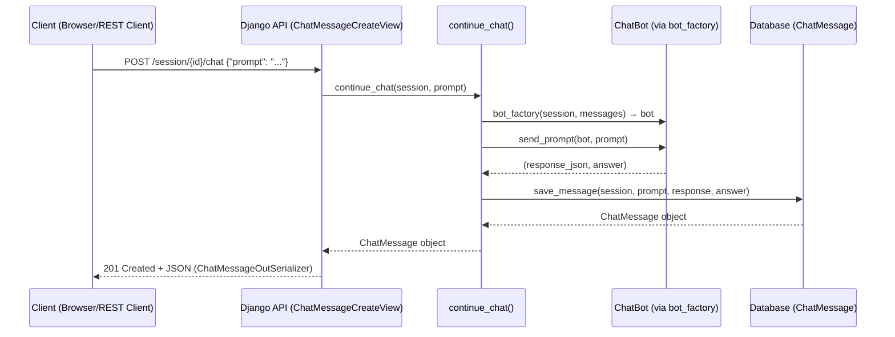

# Chatbot-Flow Tutorial (Django + DRF + OpenAI)

Dieses Tutorial beschreibt den kompletten Ablauf einer Chat-Nachricht in deinem Django-System
von der REST-Request bis zur gespeicherten Antwort. 

Die Komponenten sind:

* Django REST Framework Views
* Serializer
* Chat-Flow-Service (`continue_chat`)
* Bot-Fabrik (Dummy / OpenAI / OpenAI+RAG)
* Datenbank (ChatSession, ChatMessage)

---

# 1. Überblick: Ablaufdiagramm



---

# 2. Der Chat-Flow in Worten

## 2.1 Client → API

Der Client sendet:

```json
POST /api/chat/session/{id}/chat
{"prompt": "Hallo, wie geht’s?"}
```

Die View `CreateChatMessageView`:

1. überprüft, ob die Session dem User gehört
2. validiert das Prompt
3. ruft `continue_chat(session, prompt)` auf

Die View selbst erzeugt **keine Bot-Antwort** – sie delegiert alles an den Chat-Flow.

---

# 3. Die drei Schichten im Chat-Flow

## 3.1 a) Session-Nachrichten sammeln

`get_session_messages(session)` baut eine neutrale Bot-Historie:

```
SYSTEM: initial_message
USER:    prompt1
ASSISTANT: response1
USER:    prompt2
ASSISTANT: response2
...
```

Diese Struktur ist für alle Bot-Typen gleich.

---

## 3.2 b) Bot-Instanz erzeugen (Bot Factory)

Je nach Session:

| Provider   | Bot Klasse       |
| ---------- | ---------------- |
| dummy      | Dummybot         |
| openai     | OpenAIChatbot    |
| openai_rag | OpenAIRAGChatbot |

Factory-Logik ist in `continue_chat()` eingebettet.

Beispiel:

```
if session.provider == "openai":
    bot = OpenAIChatbot(model, initial_message, messages)
```

---

## 3.3 c) Prompt an Bot senden

`send_prompt(bot, prompt)` ist eine einfache Abstraktion:

```
return bot.talk(prompt)
```

Das Ergebnis ist:

```
(message_text, message_dict)  # z. B. JSON aus OpenAI
```

Der Bot kann intern OpenAI, RAG, Dummy, oder andere Provider verwenden.

---

# 4. Speichern im Backend

`save_message()` macht daraus ein `ChatMessage`-Objekt:

* `prompt` (User)
* `response_message` (Antwort)
* `response_json` (z. B. OpenAI-Payload)

Beispiel:

```
ChatMessage(session=session, prompt="...", response_message="...", response_json={})
```

Dieses ChatMessage-Objekt geht zurück an die View.

---

# 5. API Response

Die View `CreateChatMessageView` serialisiert:

```json
{
  "id": 42,
  "session": 1,
  "prompt": "Hallo",
  "response_message": "Hallo! Wie kann ich helfen?"
}
```

Status: `201 Created`

---

# 6. Starten einer Session

Die Session wird mit:

```
POST /api/chat/start
```

angelegt.

Der `ChatSessionInputSerializer`:

* prüft den Kontext
* kombiniert:

  * Context-Systemprompt
  * User-Startnachricht
* speichert:

  * provider
  * model
  * initial_message

Damit hat jeder User eine eigene Bot-Session.

---

# 7. Wichtige Design-Entscheidungen

## 7.1 Bot-Unabhängigkeit

Alle Bots implementieren dieselbe Methode:

```python
talk(prompt) -> (message, message_dict)
```

→ dadurch funktioniert OpenAI, Dummy und RAG identisch.

---

## 7.2 State-Management in Django

Die Bot-Historie ist **in der Datenbank**, nicht im Speicher:

```
ChatMessage(prompt, response_message)
```

So können mehrere Worker & Instanzen gleichzeitig arbeiten.

---

## 7.3 Session-basierter Systemprompt

`initial_message = context.system_prompt + initial user message`

→ Pro Session unterschiedliche Rollen, Modelle, Prompts.

---

# 8. Gesamtübersicht

**Client**
↓
**CreateChatMessageView** (Validierung)
↓
**continue_chat(session, prompt)** (Flow-Logik)
↓
**Bot** (OpenAI/Dummy/RAG)
↓
**save_message()**
↓
**Datenbank**
↓
**Response** (JSON Message)

---

# 9. Wo erweitern?

* mehr Bots → einfach neue Klasse mit `.talk()`
* mehr Kontext → ChatbotContext erweitern
* Memory → mehr Nachrichten in `deque(...)`
* RAG → passenden Provider aktivieren
* Streaming → Bot.talk() anpassen (Server-Sent Events)
