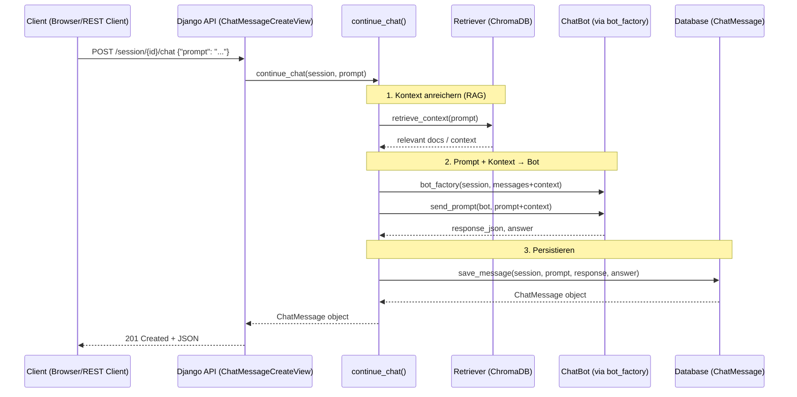

# RAG Flow Tutorial (Django + ChromaDB + OpenAI)

Dieses Tutorial beschreibt die Architektur des **Retrieval-Augmented Generation (RAG)** Systems:

* User sendet eine Chat-Nachricht
* System holt passende Wissens-Snippets aus ChromaDB
* Diese Snippets werden mit dem Prompt kombiniert
* OpenAI generiert eine bessere, kontextuelle Antwort
* Die Antwort wird gespeichert und zurückgegeben


---

# 1. Gesamtüberblick (Diagramm)



---

# 2. Was bedeutet RAG?

**RAG = Retrieval-Augmented Generation**
Der Bot:

1. sucht relevante Wissens-Chunks in Vektor-Datenbank (ChromaDB)
2. kombiniert diese mit Systemprompt + Query
3. erzeugt eine Antwort mit OpenAI

Beispiel:

> User fragt: „Wie storniere ich mein Eventim-Ticket?“
>
> ChromaDB liefert passende Stellen aus den Textdokumenten.
>
> → Antwort ist **präziser**, als wenn GPT nur „Halluziniert“.

---

# 3. Schritt 1 – Kontext holen (Retriever)

Der Retriever ist:

```
get_context_chunks(collection_name, prompt)
```

Ablauf:

1. Prompt wird per OpenAI-Embeddings in einen Vektor umgewandelt
2. ChromaDB sucht ähnliche Dokument-Chunks
3. Ergebnis: 2–5 Textblöcke (z. B. Auszüge aus Eventim AGB)

Diese werden später dem Bot als zusätzlicher System-Kontext übergeben.

---

# 4. Schritt 2 – RAG-Bot erzeugen und befragen

Dein RAG-Bot (`OpenAIRAGChatbot`) erweitert den normalen OpenAI-Bot.

Er baut seine Nachrichten so auf:

```
SYSTEM: initial_message
SYSTEM: <kontext-blöcke aus Chroma>   # RAG
USER:   <prompt>
```

Wichtig:

* historische Nachrichten können (optional) zugemischt werden
* Kontext wird mit --- getrennt
* OpenAI bekommt so *Grounded Knowledge*

Beispiel-Kontextblock:

```
Eventim Rückgaberegel:
- Tickets sind 14 Tage rückerstattbar
- Online-Käufe benötigen Bestellnummer
---
Weitere Info:
- Gebühren können variieren
```

---

# 5. Schritt 3 – Bot generiert Antwort

Der Bot ruft OpenAI:

```
client.chat.completions.create(
    model=session.model,
    messages=adhoc_messages,
    temperature=0
)
```

Danach liefert er:

* `message` (Text-Antwort)
* `response_json` (komplette OpenAI-Payload)

Diese werden an den Flow zurückgegeben.

---

# 6. Schritt 4 – Speichern in Datenbank

`save_message()` legt in `ChatMessage` ab:

* prompt
* response_message
* response_json
* Zugehörige Session

Später werden diese Nachrichten für Verlauf + Kontext genutzt.
